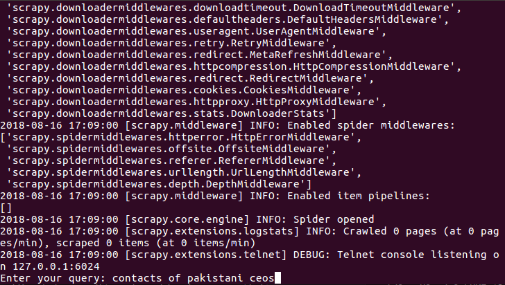
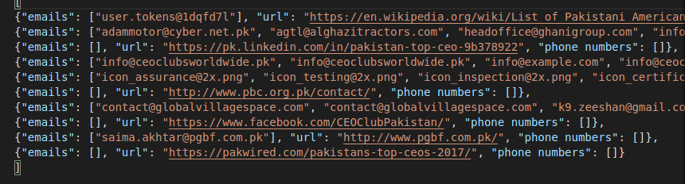

# Python-Scrapy-Email-Phone-Number-Crawler
This python script search/google certain keywords, crawls the webpages from the results, and return all emails & phone numbers found.
<br>
Sometime we cant find the emails of persons relevant to our business, we need a way to find emails of our relevant persons
this repository can help
<br>
## Getting Started

To use this repo just download the repository, download scrapy. Start creating something awesome! Good Luck!

### Prerequisites

Things reuired<br>
1. Python3
2. Scrapy

### Usage

Start the search with a keyword. I used "contacts of ceos in Pakistan" as an example.
  ```python
  scrapy crawl emailspider -o output.json
  or
  scrapy crawl emailspider -o output.csv  
  ```
  


The search and crawling process will take quite a while as it retrieves maximum results from Google & try to crawl all of them.
After the process finished, you can see output in specified file



## Built With

* [Scrapy](https://scrapy.org/) - The main framework for this crawler

## Contributing

Feel free to submit pull requests to me.


## Authors

* **Muhammad Haseeb** - *Initial work* - [Muhammad Haseeb](https://github.com/iam-mhaseeb)


## License

This project is licensed under the MIT License - see the [LICENSE](LICENSE) file for details
